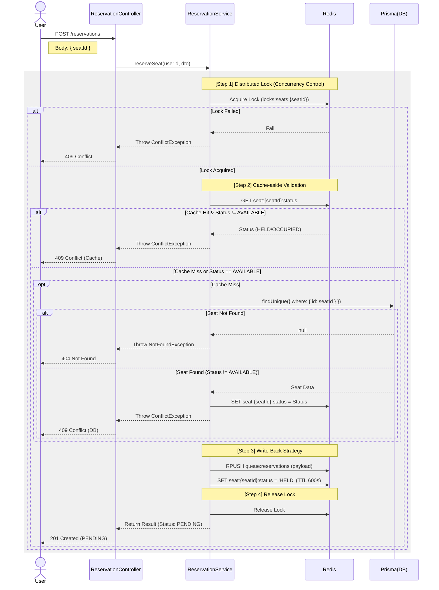

# 🎫 Fast Pass (High-Performance Reservation System)

대규모 트래픽 환경에서도 **데이터 정합성**을 보장하며 안정적으로 좌석을 예약할 수 있는 **선착순 예약 시스템**입니다.  
콘서트 티켓팅, 수강 신경 등 경쟁이 치열한 예약 시나리오를 해결하기 위해 설계되었습니다.

---

## 🚀 Key Features

- **🔒 완벽한 동시성 제어 (Concurrency Control)**
  - **1차 방어**: `Redis` 기반의 분산 락(Redlock)을 사용하여 다중 서버 환경에서의 레이스 컨디션 방어.
  - **2차 방어**: `PostgreSQL`의 Optimistic Lock (Version checking)을 통해 락 만료 등의 엣지 케이스에서도 데이터 무결성 보장.
- **⚡ 고성능 비동기 쓰기 전략 (Write-Back Strategy)**
  - 쓰기 지연 처리를 통한 처리량 극대화: 예약 요청 시 DB에 직접 Write 트랜잭션을 발생시키지 않고, Redis Queue에 우선 적재하여 DB의 I/O 부하를 분산.
  - 응답성 개선: 사용자에게는 예약 접수(Pending) 상태를 즉시 응답하여 UX를 개선하고, 백그라운드 워커가 순차적으로 DB에 영속화하는 아키텍처 구현.
  - 데이터 안정성 확보: Redis의 AOF(Append Only File) 설정과 noeviction 정책을 결합하여 비동기 처리 중 발생할 수 있는 데이터 유실 리스크를 최소화.
- **🛡 보안 (Security)**
  - `JWT` (Access Token) 기반 인증 시스템.
  - `Bcrypt`를 이용한 비밀번호 암호화.
- **📊 성능 중심 설계**
  - `K6` 부하 테스트를 통해 500+ VUs(Virtual Users) 환경에서의 안정성 검증.
  - Raw Query 및 인덱스 최적화를 통한 DB 성능 극대화.
---

## 🔄 Reservation Flow

대규모 트래픽 상황에서 데이터 정합성을 유지하기 위한 예약 프로세스 flow입니다. 
분산 락을 통한 동시성 제어와 Write-Back 전략을 통한 성능 최적화를 포함합니다.

<details>
<summary><b>시퀀스 다이어그램 보기 (Click)</b></summary>


</details>

---

## 🛠 Tech Stack

| Category         | Technology               |
| ---------------- | ------------------------ |
| **Framework**    | NestJS (Node.js)         |
| **Database**     | PostgreSQL, Prisma ORM   |
| **Cache / Lock** | Redis (ioredis, redlock) |
| **Testing**      | Jest, K6 (Load Testing)  |
| **Infra**        | Docker, Docker Compose   |
| **Language**     | TypeScript               |

---

## ⚙️ Installation & Running

### 1. Prerequisites

- Node.js (v18+)
- Docker & Docker Compose

### 2. Setup

```bash
# Repository Clone
git clone https://github.com/chya-chya/fast_pass.git
cd fast_pass

# Install Dependencies
npm install

# Environment Setup
# .env 파일을 생성하고 비밀키 등을 설정해야 합니다. (기본값은 docker-compose와 연동됨)
```

### 3. Run with Docker (Recommended)

DB(Postgres), Redis, App을 한 번에 실행합니다.

```bash
docker-compose up -d --build
```

- **API Server**: `http://localhost:3000`
- **Swagger API Docs**: `http://localhost:3000/api`

---

## 🧪 Testing

### Unit & E2E Test

```bash
# Unit Tests
npm run test

# E2E Tests
npm run test:e2e
```

### Load Test (K6)

대규모 트래픽 시뮬레이션을 위해 K6 스크립트가 준비되어 있습니다.

```bash
# K6 설치 (Mac)
brew install k6

# 로컬 서버 실행 후 테스트 진행
K6_WEB_DASHBOARD=true k6 run k6/load-test.js
```

---

## 📝 API Documentation

서버 실행 후 `/api` 경로로 접속하면 Swagger UI를 통해 명세를 확인할 수 있습니다.

- `Auth`: 회원가입, 로그인
- `Events`: 공연 이벤트 생성/조회
- `Performances`: 회차(일시) 및 좌석 자동 생성
- `Seats`: 좌석 상태 조회
- `Reservations`: 좌석 선점(Lock), 결제 확정(Confirm), 취소(Cancel)

---

## 📂 Project Structure

```text
src/
├── auth/           # 인증 (JWT, Passport)
├── common/         # 공통 모듈 (Filter, Interceptor, Redis)
├── event/          # 공연 이벤트 관리
├── performance/    # 공연 회차 관리
├── seat/           # 좌석 관리
├── reservation/    # 핵심 예약 로직 (Service, Queue, Scheduler)
└── prisma/         # DB 스키마 및 서비스
```

---

## 📈 Performance Results (Summary)

- **Concurrency**: 100% 데이터 정합성 보장 (500명 동시 요청 시 1명 성공, 499명 409 Conflict 반환).
- **Latency**: 50 VU 기준 p(95) **21ms** 달성.

---

**Author**: Suyeon Cha  
**Repository**: [https://github.com/chya-chya/fast_pass](https://github.com/chya-chya/fast_pass)
